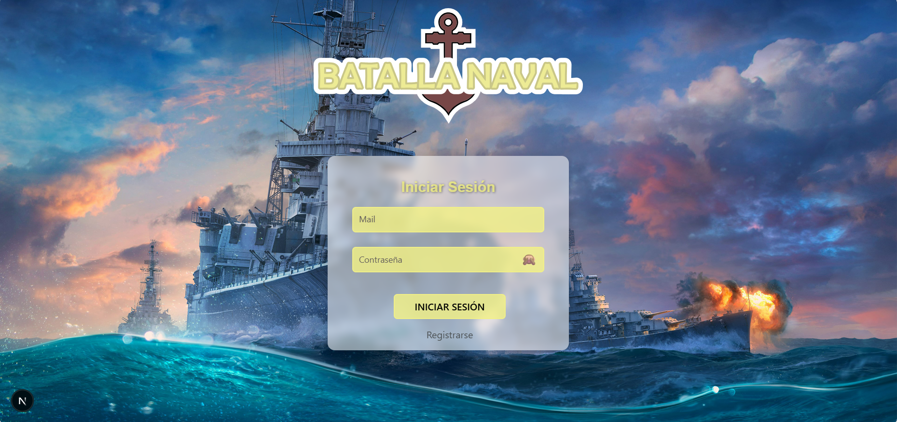
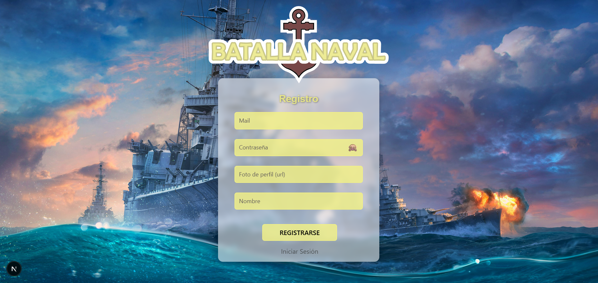

# 2025-TPIN2-G08

<h1>Proyecto Final: Batalla Naval</h1>

<h2>Introducción</h2>

Bueno para empezar este Readme, nosotros somos el grupo 8 de 5to A informatica conformado por Agustin Diez Gomez, Iñaki Barreiro, Ema Dalessandro y Nicolas Diez Almansa, de proyecto final, diseñamos un batalla navala el cual se puede jugar online y a continuacion vamos a ir explicando como fue el proceso de desarrollo y como lo hicimos.

<h2>Inicio de Sesion y Registro</h2>

Bueno para empezar el juego diseñamos un sistema de inicio de sesion y uno de registro para aquellos que no tengan usuario creado, esto principalmente fue para tener cierto orden de quien juega contra quien, su historial de partidas, su actividad en el juego y demas.

<h2>Usuario administrador</h2>

Diseñamos un usuario administrador, que quiere decir esto, que hay un usuario en especifico que tiene mas "poder" o puede hacer mas cosas en el juego que los usuarios correintes, si bien no hay mucha diferencia entre el administrador y el resto, el administrador lo unico que puede hacer que el resto no es borrar usuarios. Una vezque este usuario inicia sesion le aparece una pantalla en la que hay 2 opciones, la primera es jugar, osea que va a pasar directamente al juego y la otra es "administrar", que una vez que selecciona esta le aparece un menu el cual puede seleccionar los usuarios que desea eliminar.

<h2>Lobby</h2>

Una vez hecho el incio de sesion, el registro y el usuario administrador pasamos a la interfaz visual que veran los usuarios una vez que hayna inciado sesion, lo que seria un "lobby" o un "home". En dicho apartado el usuario puede ver a sus amigos, en caso de tener, puede agregar amigos, puede editar su perfil, puede ver las estadisticas y el historial que tiene con otros jugadores y puede enviar solicitudes para jugar con sus amigos, tambien hay un boton para que pueda ver sus notificaciones, es decir, de aquellos que le han enviado solicitud de amistad y otro para cerrar sesion. Cada usuario tiene lo que se llaman medallas, estas medallas se ganan o se pierden dependiendo de las partidas que juegue, si pierde va a perder 30 medallas, caso contrario va a ganar 30 medallas.

<h2>Sistema de solicitudes de amistad</h2>

Para que los usuarios se envien solicitudes de amistad, hay un boton de un mas (+) el cual al clickearlo le aparecn todos los usuarios a los que aun no tiene de amigo y puede seleccionar a quien mandarle, al otro usuario le va llegar a su buzon de notificaciones el cual es la campanita (🕭), este, al tocarlo se abre un apartado donde puede ver todas sus solicitudes de amistad pendientes a rechzar o aceptar, en caso de aceptar le avisara al usuario emisor de la invitacion que la ha aceptado y si la rechaza lo mismo.

<h2>Sistema de invitaciones para jugar</h2>

En anteriores apartados mencionamos que los usuarios pueden enviar solicitudes de amistad e invitaciones para jugar, las solicitudes de amistad se van a guardar para que el otro usuario pueda aceptarla o rechazarla en cualquier momento, sin embargo, las invitaciones para jugar son en tiempo real por lo que si al usuario al que se le envio una invitacion para jugar no esta conectado, no le llegara. Si esta conectado, le avisara que le llego dicha invitacion y este podra o aceptarla o rechzarla.

<h2>Juego</h2>

Una vez que un usuario ha enviado una invitacion a jugar a otro y este la acepte, los llevara a ambos a otra pagina en la que, podran ver contra quien esta jugando, y ya podran empezar a poner sus barcos en el tablero. Arriba a la izquierda hay un boton para el caso de que alguno de los 2 desee rendirse, en caso de que alguno se rinda, le avisara automaticamente al otro jugador y le sumara 30 medallas, mienstras que el que se rindio le restara 30, y los devolvera al lobby.

Los barcos se ponen de la sigueinte manera: El usuario primero debe selccionar el barco que desea poner, en caso contrario el juego le avisara que no ha seleccionado ningun barco, una vez seleccionado algun barco, debe tocar la celda por la que quiere que empiece ese barco y la celda por la que quiere que termine, en caso de que haya querido poner el barco en diagonal, el juego le avisara que no se puede, si por accidenete selecciona un rango de casillas mas largo o mas corto del que es el barco, el juego tambien le avisara. Una vez que ambos hayan puesto los barcos ya podran empezar a jugar y atacarse.

<h2>Juego en accion</h2>

Ya los 2 habiendo posicionado sus barcos, ya podran empezar atacarse. Les aparecera 2 tableros, uno el cual es el suyo, en el cual apareceran los tiros que haga el rival y otro en el que ellos van a clickear la celda que quieran para atacar, en caso de haberle pegado a un barco se pondra una imagen de una explosion, caso contrario una de agua, si alguno le dio a un barco tiene permitido volver a tirar hasta que falle un tiro. El turno lo tenés si tu nombre está titilando en verde, si el nombre del rival esta en rojo, es su turno.

Cuando alguno de los 2 gana, le aparecera en pantalla que gano y le sumara 30 medallas, lo mismo para el que perdio solo que le aviso que perdio y le restara 30 medallas.

Bueno eso fue el proyecto, esperamos que lo disfruten y se diviertan.
